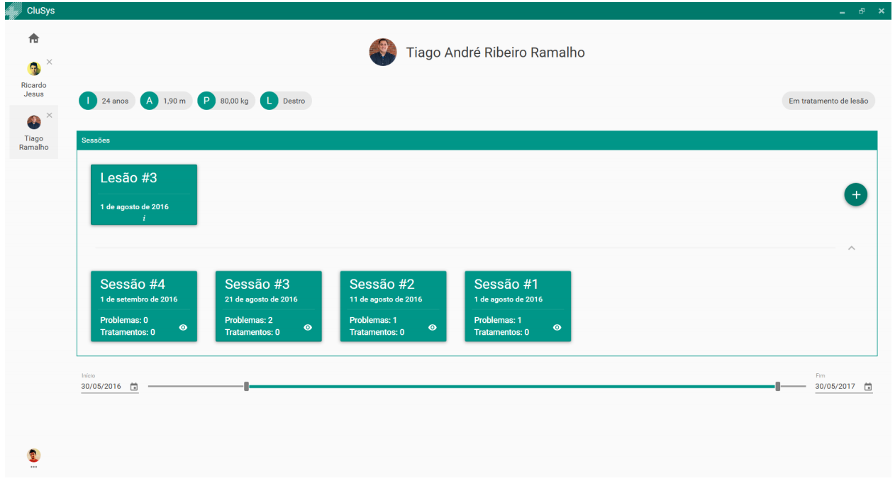

# :hospital: Sports Club Management System 

University Project ( Class: Database and Human-Computer Interaction )

Most sports clubs don't have a virtual clinical history of their athletes. So as a solution me and my co-worker <a href="https://github.com/rj-jesus">Ricardo Jesus</a> have recreated a virtual version, where the athlete's injuries are recorded. The system created allows greater efficiency in the organization of clinical data of the athletes by the medical department of a club where most of the interface requirements were proposed by a physiotherapist.  
We divide the athletes in modalities and the system permit different users with different access permissions and functionalities. The main feature is the body chart of the athlete and how easy is to add a new injury and consequently the recovery plan by the physiotherapist.

At the end of the class, we did usabilities tests for the system and we had really nice feedback. 

## Screenshots

 
